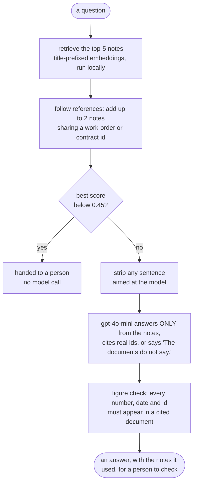

# Tanya: a cross-division RAG assistant for TGMOK Holdings

PE6201 Emerging AI Technologies · End-of-Course Project (individual) · Trixie Grace Mok

Tanya answers leadership questions from the internal documents of a fictional conglomerate with
three divisions (F&B contract manufacturing, CNC precision machine parts, gold jewellery), cites
the documents it used, says "The documents do not say." when they don't, and hands a question to
a person when retrieval confidence is too low to answer at all. It can also take a newly uploaded
document, route it to the divisions it affects (a person confirms), and brief leaders on what it
connects to in the other divisions.

The business and technical trade-off analysis is `docs/TRADEOFF_ANALYSIS.md`.

## Clone to a reproduced run

Everything in the first block runs with **no API key** (and no network after a one-off ~90 MB
download of the `all-MiniLM-L6-v2` embedder).

```bash
git clone https://github.com/tgmok/Tanya-RAG-Project
cd Tanya-RAG-Project
pip install -r requirements.txt          # read the torch note inside first
python data/check_my_data.py             # corpus, answer key and key facts hang together
python self_test.py                      # the evaluation instruments themselves are sound
python run_guardrails.py                 # every built guardrail against 39 named cases
python run_eval.py --retrieval-only      # recall and MRR of 13 retrieval setups, every miss diagnosed
python run_eval.py --chunk-sweep         # why 200-word chunks
python run_eval.py --leakage             # does a question already contain its own answer?
python cost_model.py --estimate          # cost per successful answer, break-even, time to deploy
python run_eval.py --dry-run --yes       # the whole live path with a fake model
streamlit run app.py                     # the app; retrieval works without a key
```

The answer-level evaluation needs a key (it prints an estimate, about $0.20, and asks first):

```bash
python run_eval.py --run                 # shipped system vs keyword baseline -> results/summary.md
python run_eval.py --agreement           # after grading the spot-check --run writes (temporary files)
python cost_model.py                     # measured cost per successful answer
python demo_citation_fix.py              # the bug from the screen recordings, re-run
```

The default live run compares the app, the version before reference-following and the keyword
baseline (about $0.31). Any other retrieval setup can join it with `--configs`, roughly $0.10 to $0.20 each.

The key is read from `OPENROUTER_API_KEY`, or from an untracked `OpenRouter_api.txt` in this
folder (it is in `.gitignore`), or asked for with a hidden prompt. It is never written anywhere.

## Layout

`CODE_MAP.md` has what each file does, a reading order and every command.

```
README.md                  this file
CODE_MAP.md                what each file does, reading order, commands, current results
requirements.txt           pinned; read the torch note inside before installing
config.py                  THE one place to change a setting: models, chunking, top-k, thresholds,
                           prices, cost assumptions, the corpus manifest

rag_core.py                the pipeline: load, chunk, embed, retrieve, grounded answer,
                           upload classification, impact brief. Shared by app, eval and demo.
guardrails.py              every risk mitigation that is code: token cap, injection scan and
                           strip, confidence hand-off, exact abstention, figure check, fake-citation check
app.py                     Streamlit interface: upload -> scan -> classify -> confirm -> brief -> chat
doc_parser.py              PDF/DOCX to text, no model calls

run_eval.py                the evaluation entry point                      <- what a marker runs
harness.py                 question sets, 13 retrieval configs, code checks, judge, aggregation
run_guardrails.py          guardrail checklist             -> results/guardrails.md
self_test.py               checks the instruments, not the system
cost_model.py              cost per query, per success, break-even, time to deploy -> results/cost_*.md
demo_citation_fix.py       the recorded failure, re-run    -> results/citation_fix.md
make_docs.py               regenerates docs/EVALUATION_SET.md and the blind question pack
Tanya_RAG_Notebook.ipynb   the smallest first version, and the evaluation as a narrative

data/
    fnb/ cnc/ jewellery/       the graded corpus: 18 synthetic documents, 6 per division
    generation_prompts.md      the prompts that produced the corpus, so it can be regenerated
    data_dictionary.md         every document, its division, and the hook facts it carries
    eval_questions.json        the answer key: 23 questions, fixed before anything ran
    eval_key_facts.json        the facts each answer must contain (answer correctness)
    extra_questions.json       false-premise questions (the question assumes something untrue)
    partial_questions.json     partially answerable: one part in the documents, one in none
    breaker_questions.json     deliberate attempts to break retrieval
    independent_questions.json written by a different model from the documents alone
    check_my_data.py           run after every data change
    validation_real/           small real-world slices, one per division, kept out of the corpus
    sample_uploads/            the two demo uploads: a client brief, and an injection attack
    uploads/                   added through the app; ignored by git AND by the evaluation

docs/
    TRADEOFF_ANALYSIS.md       the business & technical trade-off analysis (the hand-in)
    SYSTEM_FLOW.md             one request end to end, with every guardrail on the path
    EVALUATION_SET.md          every question, what it is for, and which check grades it
    JUDGE_PROMPT.md            the exact prompt the judge receives: a described instrument
    GOOD_RUN.md                what a good answer looks like, as testable statements
    BLIND_QUESTION_PACK.md     the documents-only pack used to write the independent questions

results/                   every number in the write-up comes from a file here
    retrieval_recall.md        13 configs, every miss diagnosed, the before/after, the threshold curve
    chunk_sweep.md             why 200/50 chunks
    leakage.md                 which questions contain their own answer, before/after stripping
    notebook_run.md            answer-level results of the final notebook run, copied verbatim
    guardrails.md              the guardrail checklist, and the Class 6 red-team categories
    cost_estimate.md           cost per successful answer, break-even, kill condition, time to deploy
    summary.md                 answer-level results (after --run)
    cost_model.md              measured cost per successful answer (after --run)
    judge_agreement.md         the judge against my own grading: precision, recall, Cohen's kappa
    citation_fix.md            the recorded bug, re-run (after demo_citation_fix.py)
```

## How a question works

A question goes in, one model call comes out, and every step around that call is code. The same
fixed path runs for every question, so this is a workflow, not an agent.



A new document takes the other entry: an injection scan, one model call that must return JSON
(divisions, reasoning, summary), a person confirming the divisions, filing and re-indexing, then a
brief built from the other divisions' notes. Every guardrail on both paths is in
`docs/SYSTEM_FLOW.md`.

## What is measured

- **Retrieval, free:** did the retrieved notes cover every division and every document a question
  needs (recall@k), and how near the top was the first of them (MRR)? Thirteen setups, including the
  shipped one (with reference-following), the version before it, the keyword baseline, "all
  documents in the prompt" and hybrid search (alone and with reference-following), with every miss
  diagnosed by rank and score.
- **The baseline is keyword search over the same chunks** (`tfidf_k5`), a non-AI method. A model
  with no retrieval is not the baseline: it has never seen these fictional documents, so it scores
  near zero whatever the retrieval does, and teaches nothing.
- **Answers, on the same 20 questions, two ways:** correctness (every key fact present, a code
  check against `data/eval_key_facts.json`) and faithfulness (every claim supported by the notes,
  judged by a different model family, prompt committed in `docs/JUDGE_PROMPT.md`). Faithfulness
  alone is won by quoting a chunk back; correctness alone cannot tell a grounded answer from a
  lucky one.
- **Abstention, as two numbers:** how often it declines, and whether the declines were right (out
  of scope, or the needed documents were not retrieved). Plus the **silent failure**: answering
  although the needed documents were not in front of the model.
- **The judge is measured too:** against 10 answers I graded by hand it agreed on all 10, caught both
  unfaithful ones and raised no false alarm (precision and recall 100%, Cohen's kappa 1.00).
- **Cost per successful answer, not per call:** the model's cents, a person checking every answer,
  and a person redoing the wrong ones, with the break-even against answering by hand, fixed monthly
  costs and a written kill condition (`results/cost_estimate.md`).
- **Question types follow the A1 break-it categories:** two documents needed (the cross-division
  questions), vocabulary mismatch, distractor, and absent but plausible (which tests abstention),
  plus two that probe invention harder: **false premise**, and **partially answerable**, where one
  part is in the documents and the other is in none (verified absent by `self_test.py`). The right
  answer gives the first part and says the second is missing; supplying it is the silent failure.
- **Sets reported separately:** main (designed before anything ran), false premise, break-it,
  partially answerable, and independent (written by another model from the documents alone).

## Limits we found

- **Faithfulness is one answer short of the 85% target: 84% in the final run.** Answer
  correctness is 85% (73% on cross-division questions). The keyword baseline is more faithful
  (100%) and less correct (75%, 55% cross-division), so embeddings earn their place on coverage and
  correctness, not on faithfulness (`results/summary.md`). The judge agreed with my own grading on
  20 of 20 answers across two checks (`results/judge_agreement.md` holds the final one).
- **Titling fixed the division, not the document; reference-following fixed most documents.**
  Title-prefixed chunks cover every needed division on all 11 cross-division questions (plain
  top-5: 91%) but left document recall at 88%, below the keyword baseline's 91%. Following the
  reference ids in the retrieved notes lifted it to 98%: the shipped retrieval misses a needed
  document on 1 of 37 scored questions (CD12, whose `jwl-02` is two links away), against 5 before.
- **The mitigation first proposed in the problem statement hurts.** Classifying the query by
  division before retrieving cuts cross-division recall to 45%, against 91% for the same
  retrieval without it, so it is not used.
- **A retrieval-score threshold is a weak abstention signal.** At the shipped 0.45 it catches 2 of
  6 unanswerable questions and wrongly hands off 1 of 37 answerable ones; answerable and
  plausible-but-absent questions overlap in score. It is a backstop, not the defence.
- **Confabulation when retrieval misses** (NIST AI 600-1's word for confidently stated wrong
  content). Earlier runs found the model answering anyway when the needed document was not
  retrieved, including one invented component; reference-following cut those answers from 3 to 1
  in the final run. The figure check catches invented numbers, dates and ids, but not an invented
  claim with none in it; the silent-failure count is how that shape is detected.
- **Citing a document it was not given.** With more notes, the model sometimes cites a document
  that the notes only mention by its code (all three unfaithful answers in the final run). The
  evaluation's citation check catches every case; it cost reference-following one faithful answer
  (89% -> 84%).
- **Uploads are untrusted input.** A pattern scan routes a suspicious upload to a person instead of
  the automatic classifier (OWASP LLM01:2026), with no false positives on the 18 real documents. If
  a person files it anyway, matching sentences are stripped from its notes before any prompt and
  the reader is warned. That is a tripwire, not a fix (an attacker can rephrase); what makes an
  injection survivable is that Tanya has no tools and no way to send anything out.
- **Hybrid search adds nothing on top of reference-following.** Fusing keyword and embedding
  rankings lifts document recall from 88% to 93% on its own, but with reference-following it reaches
  the same 98% and the same one miss as the shipped retrieval (`results/retrieval_recall.md`), so it
  is not adopted.
- **The corpus is synthetic and was written by an LLM.** The validation slices are small (8 records
  each), and the jewellery one checks pricing plausibility only.
- **Not everything is independent.** The designed questions and key facts come from the same hand
  that wrote the corpus; only the independent set was written elsewhere.
- **Machine-specific:** `torch` 2.13 and later crashed at import on the author's AMD Ryzen (Zen4)
  CPU, so 2.2.2 is pinned, which in turn needs `numpy` below 2.

## Course coverage

| class | idea | where it is in this project |
|---|---|---|
| 1 | sorting vs making; check a machine that makes | answering is making, so every answer is checked (code checks, judge, a person); routing an upload is sorting with no labelled uploads to train on, so the model suggests and a person confirms |
| 2 | the stack, build vs buy by five factors | layer-by-layer own/rent table (`docs/TRADEOFF_ANALYSIS.md`): own data, orchestration and evaluation, rent the model |
| 2 | RAG: chunking, top-k, hybrid search, contextual retrieval, long context | chunk sweep; top-k; title-prefixed chunks (contextual retrieval, shipped); hybrid search with reciprocal rank fusion (measured, adds nothing on top of reference-following); `full_context` priced against the shipped retrieval |
| 2 | evals: L1 assertions, L2 judge aligned to people, recall@k and MRR | key-fact and citation checks in code; a judge from another model family with precision, recall and kappa against hand labels; recall and MRR per config |
| 3 | fix the eval set first, change one thing, measure again | answer key frozen before any run; every retrieval change measured on the full set, including the one that failed (division classifier); reference-following adopted only after a same-run before/after on answers |
| 3 | structured output: declare the schema, then verify it | the upload classifier must reply in one JSON shape; code parses and checks it, retries once, then a person chooses; the app shows the raw JSON |
| 3 | token economics | calls x tokens x price from the real prompts (`results/cost_estimate.md`) |
| 4 | agent or workflow; the ground-truth test | a workflow on purpose: fixed steps, one call, no tools; the one variable step (search again after a miss) is a fixed code rule, reference-following |
| 5 | cost per successful task, break-even, fixed costs, kill condition | `cost_model.py`: 20% break-even against answering by hand, measured 85%, $181/month layer 3, written kill condition |
| 6 | the 2x2 (visible? undoable?), human in the loop as window, evidence and authority | retrieval and generation monitored and verified; the one write gated; the app shows the evidence under every answer |
| 6 | OWASP 2026 red-team categories, confabulation, the lethal trifecta, PDPA | `results/guardrails.md`: 39 cases and every category; two legs of the trifecta, not three; PDPA named as the binding floor |

## Extending the evaluation set

1. Add a document under `data/<division>/`, register it in `config.DOC_ID_TO_PATH`, then run
   `python data/check_my_data.py`.
2. Write the question into `data/eval_questions.json` and its key facts into
   `data/eval_key_facts.json` **before** running the system on it.
3. `python self_test.py` (every fact must appear in its source documents), then
   `python make_docs.py`, then `python run_eval.py --retrieval-only` and `--run`.

## Sources and acknowledgements

- The A1 starter notebooks (course-provided) are the scaffold for the retrieval and judge cells
  in `Tanya_RAG_Notebook.ipynb`.
- Claude (Anthropic) wrote the corpus and much of the code with the author. ChatGPT wrote the
  independent questions IND1 to IND5 from the blind pack.

## Status (2026-09-29)

- [x] RAG over 18 synthetic documents in three divisions; answers cite real document ids, and say
  "The documents do not say." when the notes do not
- [x] Keyword search over the same chunks as the baseline; 200-word chunks chosen by a sweep from 25 to 300
- [x] Correctness and faithfulness on the same 20 questions, final run: 85% correct (baseline 75%),
  84% faithful (baseline 100%)
- [x] The judge checked against my own grading twice: 20 of 20 agree (`results/judge_agreement.md`)
- [x] 43 questions in five sets, including 6 partially answerable: none invented the missing half
- [x] Guardrails in code, 39 of 39 cases, every Class 6 red-team category addressed
- [x] Cost per successful answer $3.50 at 85%, break-even 20% against answering by hand, a kill condition
- [x] Reference-following adopted after a same-run before/after: misses 5 of 37 -> 1, correctness
  80% -> 85%; hybrid search measured and not adopted: it adds nothing on top of reference-following
- [x] Trade-off analysis in `docs/TRADEOFF_ANALYSIS.md`, under 1,200 words
- [ ] Demo video and NTULearn submission
