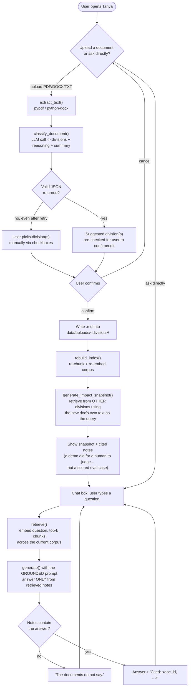
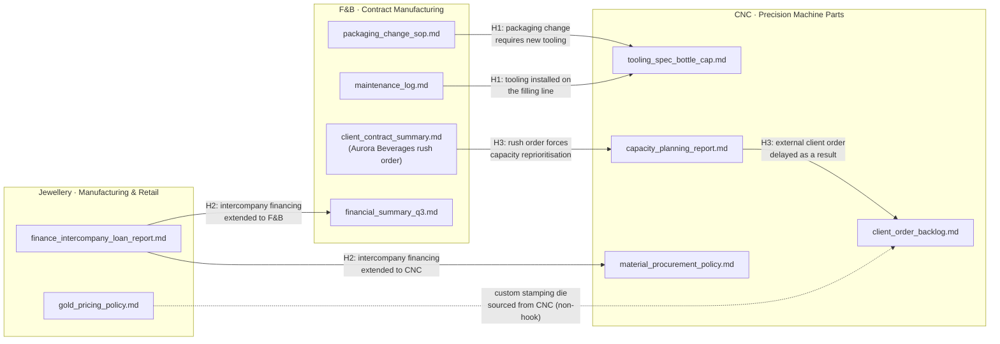

# Tanya · system flow

How the Streamlit demo (`webapp/app.py`) routes a request, and how TGMOK Holdings'
three divisions are connected in the underlying corpus.

## Request flow

Two entry points converge on the same retrieval-and-answer path. Uploading a
document is optional -- a user can go straight to asking a question.

## Why the upload path never touches the graded corpus

`data/fnb/`, `data/cnc/`, `data/jewellery/` are the fixed, hand-verified corpus
that `eval_questions.json`'s 23 questions were written against, per the
watch-outs' "fix the ground truth before you run anything." A live upload has no
pre-verified answer, so it's filed into a separate `data/uploads/<division>/`
tree instead -- the retrieval index includes it once confirmed, but it never
becomes a new scored eval case.

## How the three divisions are connected

The fixed corpus was built around three deliberate cross-division "hooks" (see
`generation_prompts.md`), each split across two or more divisions' documents so
that a single-division answer is necessarily incomplete:

A question that only retrieves from one division in a hook pair will always be
incomplete -- this is exactly what Section 7's context-recall metric measures,
and what the notebook's naive-vs-filtered "break it" comparison demonstrates
directly (see `Tanya_RAG_Notebook.ipynb`, section 9).
