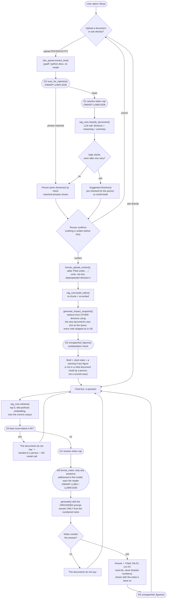
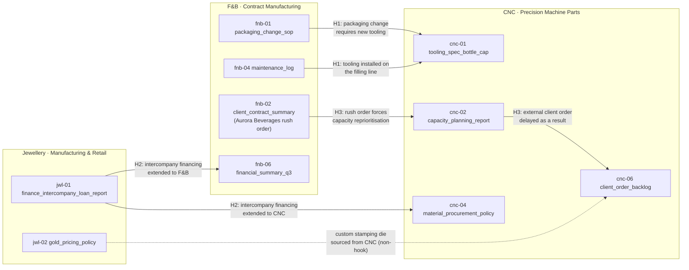

# Tanya · system flow

How the app (`app.py`) routes a request, where each built guardrail (`guardrails.py`) sits on
that path, and how TGMOK Holdings' three divisions are connected in the underlying corpus.

It is a workflow, not an agent (Class 4): the code fixes every step, the model is called once per
question, and it has no tools, so the only thing it can produce is text a person reads. The one
write in the system, filing an upload, waits for a person to confirm.

## Request flow

Two entry points converge on the same retrieval-and-answer path. Uploading a document is
optional -- a user can go straight to asking a question. Every rounded box marked **G** is code,
not prompt, and is exercised against named cases by `python run_guardrails.py`
(`results/guardrails.md`).

## Why the upload path never touches the graded corpus

`data/fnb/`, `data/cnc/`, `data/jewellery/` are the fixed, hand-verified corpus that
`data/eval_questions.json`'s 23 questions were written against, per the watch-outs' "fix the
ground truth before you run anything." A live upload has no pre-verified answer, so it is filed
into a separate `data/uploads/<division>/` tree instead -- the app's index includes it once a
person confirms it, but git ignores that folder and the evaluation never reads it, so nothing
done in the app can move a reported number.

## How the three divisions are connected

The fixed corpus was built around three deliberate cross-division "hooks" (see
`data/generation_prompts.md`), each split across two or more divisions' documents so that a
single-division answer is necessarily incomplete:

A question that only retrieves from one division in a hook pair will always be incomplete --
this is what the context-recall metric measures. The shipped retrieval covers every
needed division on all 11 cross-division questions, but still misses a needed *document* on 5 of
37 scored questions; three of those are the same CNC tooling spec, `cnc-01`, diagnosed in the
notebook's "break it" section (`results/retrieval_recall.md` lists every miss).
